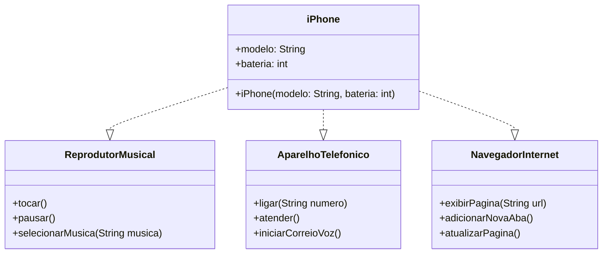

# Modelagem e Diagramação de um Componente iPhone

Desafio de POO (Programação Orientada a Objetos) - Digital Innovation One

**Professor:** Gleyson Sampaio

## 📱 Descrição do Projeto

Modelagem UML e implementação Java das funcionalidades básicas de um iPhone, baseado no lançamento de 2007, contemplando:

- Reprodutor Musical
- Aparelho Telefônico  
- Navegador na Internet

## 📊 Diagrama UML

## Autor 
<table>
  <tr>
    <td>
      
    </td>
    <td align="left">
      <a href="https://github.com/H4ttiz">
        <b>Leonardo Bezerra da Silva</b>
      </a>
       
      Desenvolvedor Back-end
    </td>
  </tr>
</table>
